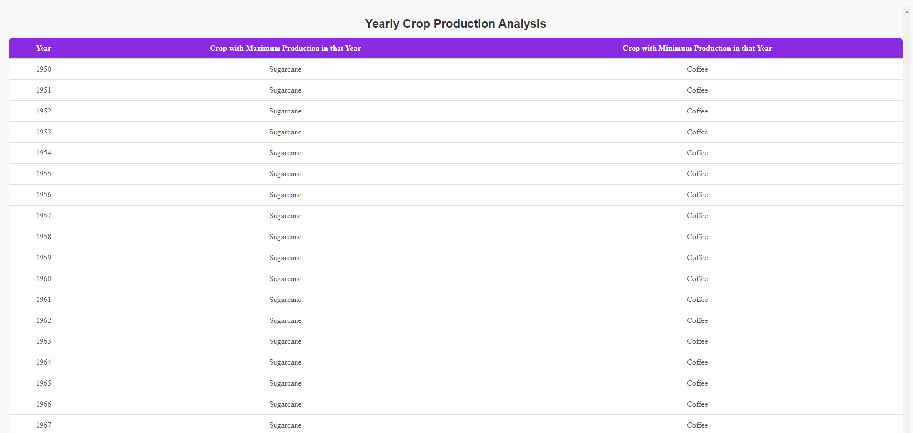
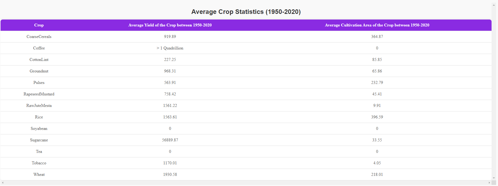

# Agriculture Analytics App

A robust data analytics dashboard for visualizing agricultural crop data. Built with **React** and **TypeScript**, this app presents insightful data on crop yields, cultivation areas, and other metrics in a user-friendly, dynamic interface.

## Table of Contents

- [Features](#features)
- [Installation and Setup](#installation-and-setup)
- [Usage](#usage)
- [Technologies Used](#technologies-used)

---

## Features

- **Data Visualization**: Interactive tables displaying crop yield metrics and cultivation area statistics.
- **Dynamic Large Number Formatting**: Handles extremely large numbers gracefully, capping at a maximum readable value and formatting in millions (M), billions (B), or trillions (T).
- **Responsive Design**: Adapts seamlessly to different screen sizes.
- **Modular Component Structure**: Clean, maintainable, and reusable React components for easy updates and expansion.

markdown
Copy code

## Installation and Setup

### Prerequisites

Ensure you have **Node.js** and **Yarn** installed on your machine.

1. **Clone the repository**:

   git clone https://github.com/your-username/my-agriculture-analytics-app.git
   cd my-agriculture-analytics-app
Install dependencies:

  yarn install

Start the development server:

  yarn start
  The app will be available at http://localhost:3000.

Usage
Upon launching the app, navigate to the homepage where you can view tables of crop statistics. The data is formatted for readability, especially with large datasets. Key sections include:

TableOne: Primary metrics on crop yield.

TableTwo: Detailed average statistics per crop type with special formatting for large values.

Technologies Used
**React with TypeScript**: Frontend framework and typing.
**Mantine**: UI library for components and styling.
**Yarn**: Package management and script running.